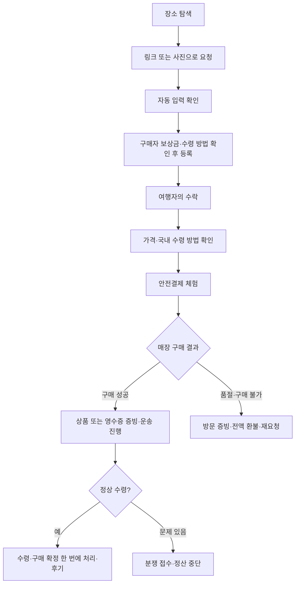
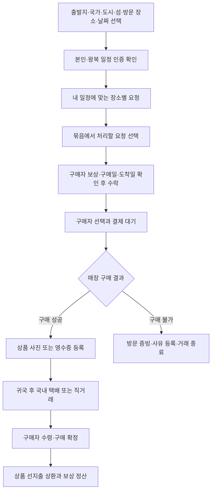

# 모아 · IA와 사용자 흐름

가칭 **모아**. “가는 김에, 하나 더.” 이미 예정된 방문과 그곳의 구매 수요를 모은다. 상표·도메인 확보를 뜻하지 않는다. 5초 안에 서비스 이해, 30초 안에 부탁 등록은 사용성 목표이며 아직 실측하지 않았다.

## 1. Information Architecture

| 영역     | 1차 화면                            | 연결 화면                                               | 역할                         |
| -------- | ----------------------------------- | ------------------------------------------------------- | ---------------------------- |
| 진입     | 스플래시, 온보딩                    | 로그인·회원가입 체험                                    | 계정 하나, 두 역할           |
| 홈       | 현재 모드의 장소·일정 중심 홈        | 도시 탐색, 장소 상세, 요청 상세, 묶음 요청               | 이용 모드는 MY·설정에서 전환 |
| 둘러보기 | 도시·장소·상품·경로 검색            | 목록·지도, 장소 상세, 요청 상세                         | 국가·도시 필터              |
| +        | 부탁·여행 선택 하단 시트             | 이거 부탁하기 / 여행 등록                               | 작성 중 하단 탭 숨김         |
| 거래     | 내 부탁 / 받는 거래 / 가져오는 거래 | 수락, 결제, 공개 일정, 진행현황, 채팅, 구매 인증, 수령 확인 | 상태와 다음 행동 중심        |
| MY       | 프로필·인증·거래 지표와 그룹 메뉴    | 여행 일정, 관심 장소, 배송지, 직거래 기록, 결제, 정산, 알림, 설정 | 연결 전 기능은 준비 상태 안내 |

## 2. 구매자 User Flow

## 3. 여행자 User Flow

## 4. 묶음 규칙

- 동일 `placeId` + 여행 국가 + 실제 방문 장소 + 수락 가능한 상태 + 수령 기한 충족 요청을 묶는다. 한 여행에는 같은 국가의 여러 도시를 등록할 수 있다.
- 수량·중량은 여행자가 등록한 최대 처리 수량 안에서 선택한다. 현장 재고·매장별 구매 제한은 확인 필요로 표시한다.
- 서로 다른 구매자의 주문을 하나의 결제로 합치지 않는다. 여행자가 일괄 수락하면 구매자별 거래와 채팅방을 만든다.
- 이미 매칭된 요청, 자기 요청, 날짜가 맞지 않는 요청은 제외한다. 보상 합계와 상품 선지출 금액을 분리한다.
- 동선 추가 시간은 지도 엔진 미연동 상태에서 샘플 추정값임을 표시한다. 실제 길찾기 결과처럼 표현하지 않는다.

## 5. 가격과 안전결제

JPY는 고정 **데모 환율 1 JPY = 9.4 KRW**. 실제 환율이 아니다. 예상 결제 금액은 서버와 앱이 동일한 규칙으로 계산한다.

`구매자 결제 총액 = 수량 반영 상품 환산액 + 여행자 보상 + 국내 전달비 + 세금 예치액`

귀국 후 국내 택배는 3,500원, 직접 전달은 0원이다. 신규 부탁은 구매자가 원화 보상금 `requestedReward`를 정하고 여행자가 그 금액을 확인해 수락한다. 보상은 상품가의 10%로 자동 산정하지 않는다. 체험 범위는 원 단위 0~200만원이며, 묶음에도 각 부탁의 등록 보상을 적용한다. 보상이 없는 이전 데이터에만 여행자 입력을 허용하며 이미 합의·결제한 금액을 재계산하지 않는다.

국가 간 이동은 여행자의 원래 동선이므로 별도 국제배송비를 더하지 않는다. 구매자에게 플랫폼 수수료를 부과하지 않으며, 여행자 보상의 10%를 거래별로 반올림하여 정산 시 운영 수수료로 공제한다. 묶음의 예상 순보상도 각 거래의 공제액을 합산한다. 이 공제는 여행자에게만 표시한다. 세금 예치액은 데모에서 0원이며 실운영 세액 확정이 아니다.

전달 방식 타입과 API 입력은 `DOMESTIC_PARCEL` / `MEETUP`만 허용한다. 3,500원은 국내 택배의 데모 예상비이며 택배사 실시간 견적이 아니다. 예전 저장 데이터의 `INTERNATIONAL_SHIPPING`은 로드 시 국내 택배로 정리하고, 미결제 거래만 다시 계산한다. 파일 저장소는 변경 전 원본을 `.before-domestic-delivery-<timestamp>.bak`으로 보관한다. 이미 결제·환불·정산된 거래의 금액은 덮어쓰지 않으며 이전 체험 금액임을 표시한다.

결제는 Mock이며 실제 자금을 수취·보관하지 않는다. 실운영은 계약된 PG·수탁 주체, 공급자 지급 정책, 결제수단별 보관·환불 절차를 확정한 뒤 연결한다. 여행자가 상품대금을 선지출하고 구매 확정 뒤 상환받는 구조를 제안 화면에 표시한다.

## 6. MVP와 출시 전 검증

국가 선택은 일본·한국·대만·홍콩·중국·태국·베트남·싱가포르·말레이시아·인도네시아를 지원한다. 국가 안에서 도시·섬을 여러 곳 선택하고, 세부 여행지가 정해지지 않았다면 국가만 선택한다. 여행 지역·방문 예정지 카탈로그는 유한한 예시 데이터이며 모든 해외 장소의 검색·재고를 제공하는 것은 아니다. 성수·잠실·제주는 국내 UX 테스트 데이터다. 식품·의약품·주류·담배·고가 명품은 요청 카테고리에서 제외한다. 패션 잡화도 소재·품목별 규제 확인이 필요하므로 카테고리 허용이 개별 상품의 합법성을 보증하지 않는다.

해외 구매와 귀국은 여행자의 원래 일정에 포함되어야 하며, 수령 국가와 여행자의 출발 국가가 같아야 한다. 구매자가 선택하는 전달 방식은 귀국 후 국내 택배 또는 직접 전달이다.

## 7. 핵심 화면 설계

온보딩은 두 역할을 짧게 소개한다. 로그인 후 이용 모드는 MY·설정에서 바꾸고 홈에는 현재 모드를 작게 표시한다. 구매자 홈의 중심은 여행 도시와 방문 장소다. 링크·사진 요청은 작은 빠른 시작 영역에 두며 최근 본 장소를 다시 찾을 수 있다. 여행자 홈은 일정·장소별 부탁 수·등록된 보상 합계를 먼저 보여준다. 거리와 이동 시간은 실제 경로 계산이 없으면 예시로 표시한다.

부탁 작성은 링크·사진→자동 입력 확인→보상과 수령 방법→등록 순서다. 여행 작성은 기본 주소·현재 위치로 출발지 확인→국가·도시·섬 선택→방문 예정지 선택→출국·귀국일→항공권 대조다. 자유 텍스트를 강제하지 않고 카탈로그 검색과 선택을 우선한다. 등록·결제처럼 집중이 필요한 화면에서는 하단 탐색 탭을 숨기고 뒤로가기·주 행동을 남긴다. `+`는 부탁·여행 중 시작할 일을 고르는 시트다.

거래 화면은 현재 단계·다음 행동·대화하기를 가깝게 둔다. 여행자 선택에서는 도착일/보상/인증/후기를 확인한다. 구매 후에는 상품 사진 또는 영수증 중 하나 이상으로 인증한다. 품절·휴무·구매 제한이면 환불 전에 구매자와 다른 매장 방문 여부를 상의할 수 있다. 환불을 선택하면 방문 증빙과 사유를 기록하고 결제금을 전액 환불하며, 구매자는 같은 상품을 다시 부탁할 수 있다.

MY는 작은 프로필, 거래·응답 지표, 활동/거래 준비/도움말 그룹으로 구성한다. 배송지 편집에는 취소와 저장을 제공하고, 완료한 직거래의 장소 기록만 보여준다. 여행 목록은 `destinationAreas`·`customStops`를 표시하고 없어진 장소를 참조해도 멈추지 않는다. 결제수단·정산 계좌·본인 인증·푸시 알림의 미연결 상태는 시트에서 설명하고 관련 거래나 일정으로 이동하게 한다. 미연결 기능을 등록 완료로 표시하거나 민감한 정보를 수집하지 않는다. 체험 사용자 전환은 설정의 접힌 별도 영역에 둔다.

알림·채팅·프로필은 거래 보조다. 커뮤니티와 여행일기는 추가하지 않는다. 대기·오류·빈 목록은 다음 행동을 제공한다. 상태가 바뀐 요청은 새로고침 후 다시 선택하도록 안내한다.

## 8. 성장 실험

첫 실험 단위는 국가 전체가 아니라 `방문 장소 × 방문일`. 3개 장소에 여행자와 요청자를 함께 모으고 첫 제안 시간·요청당 유효 제안 수·제안 선택률·결제 전 이탈·기한 내 전달률·분쟁률·묶음당 보상/선지출을 측정한다.

- 수요: 공유 상품 링크가 포함된 요청 초대, 장소 즐겨찾기, 재고 확인이 필요한 한정 굿즈.
- 공급: 여행 확정 이후 일정 등록, 원래 방문 장소에서만 묶음 추천. 수익 보장 문구 금지.
- 핵심 지표: `정상 구매 확정된 요청 / 매칭된 요청`, 장소별 양측 재거래율.
- 이벤트: request_started, metadata_result, request_created, trip_created, bundle_offer_sent, offer_selected, payment_held, receipt_uploaded, delivery_confirmed, dispute_opened, payout_settled.
- 서비스 이해 5초/부탁 등록 30초는 사용자 테스트 목표다. 실측 성과라고 주장하지 않는다. 현재 변경의 자동·모바일 검증 결과는 [05-validation.md](05-validation.md)에 별도로 기록한다.

## 참고

- Grabr 공식 거래 구조: https://grabr.io/en/how-grabr-works (2026-09-14 확인). 여행자의 제안, 구매자의 선택, 수령 후 지급이라는 원리만 참고한다.
- Expo 공식 SDK 54: https://docs.expo.dev/versions/v54.0.0/ . 버전을 고정해 재현성을 우선한다.
- NestJS: https://docs.nestjs.com/first-steps . Controller/Service/Repository 분리를 사용한다.
