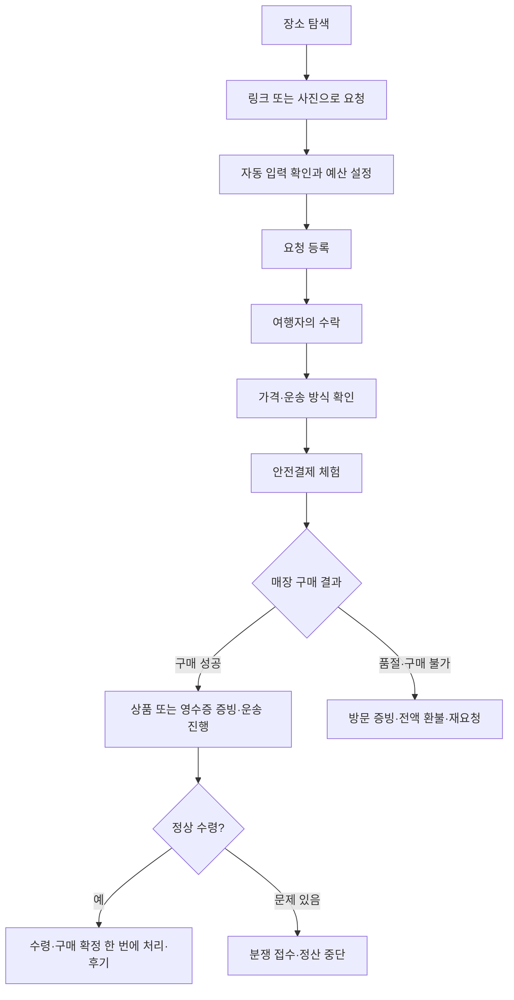
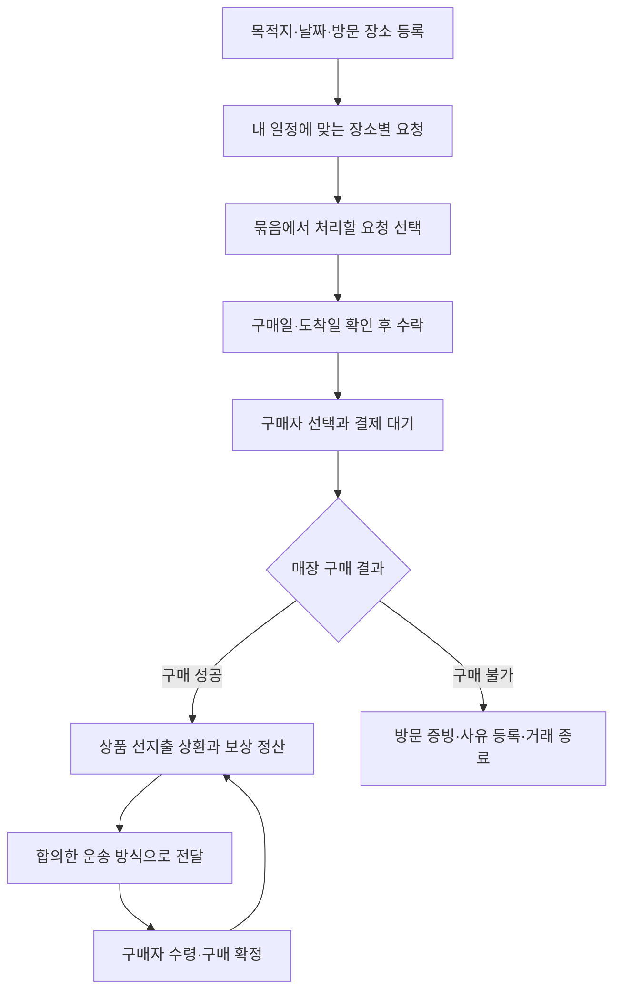

# 모아 · IA와 사용자 흐름

가칭 **모아**. 이미 예정된 방문과 그곳의 구매 수요를 모은다. 이름과 수수료는 검증 전 가설이다. 상표·도메인 확보를 뜻하지 않는다.

## 1. Information Architecture

| 영역     | 1차 화면                            | 연결 화면                                               | 역할                         |
| -------- | ----------------------------------- | ------------------------------------------------------- | ---------------------------- |
| 진입     | 스플래시, 온보딩                    | 로그인·회원가입 체험                                    | 계정 하나, 두 역할           |
| 홈       | 부탁할게요 / 가져올게요              | 장소 상세, 요청 상세, 묶음 요청                         | 역할 전환 즉시 반영          |
| 찾아보기 | 도시·장소·상품·경로 검색            | 장소 상세, 요청 상세                                    | 최근 검색·도시 필터          |
| +        | 이거 부탁하기 / 일정 등록           | 링크·사진 입력, 확인, 성공                              | 구매 요청 1분, 일정 1분 목표 |
| 거래     | 내 부탁 / 받는 거래 / 가져오는 거래 | 수락, 결제, 공개 일정, 진행현황, 채팅, 구매 인증, 수령 확인 | 상태와 다음 행동 중심        |
| MY       | 내 프로필                           | 여행 일정, 관심 장소, 인증 상태, 정산, 후기, 알림, 설정 | 개인정보 대신 인증 결과      |

## 2. 구매자 User Flow

## 3. 여행자 User Flow

## 4. 묶음 규칙

- 동일 `placeId` + 여행 국가 + 실제 방문 장소 + 수락 가능한 상태 + 수령 기한 충족 요청을 묶는다. 한 여행에는 같은 국가의 여러 도시를 등록할 수 있다.
- 수량·중량은 여행자가 등록한 최대 처리 수량 안에서 선택한다. 현장 재고·매장별 구매 제한은 확인 필요로 표시한다.
- 서로 다른 구매자의 주문을 하나의 결제로 합치지 않는다. 여행자가 일괄 수락하면 구매자별 거래와 채팅방을 만든다.
- 이미 매칭된 요청, 자기 요청, 날짜가 맞지 않는 요청은 제외한다. 보상 합계와 상품 선지출 금액을 분리한다.
- 동선 추가 시간은 지도 엔진 미연동 상태에서 샘플 추정값임을 표시한다. 실제 길찾기 결과처럼 표현하지 않는다.

## 5. 가격과 안전결제

JPY는 고정 **데모 환율 1 JPY = 9.4 KRW**. 실제 환율이 아니다. 예상 결제 금액은 서버와 앱이 동일한 규칙으로 계산한다.

`구매자 결제 총액 = 수량 반영 상품 환산액 + 여행자 보상 + 국내 전달비 + 세금 예치액`

귀국 후 국내 택배는 3,500원, 직접 전달은 0원이다. 새 제안의 여행자 보상은 수량을 반영한 상품 원화 환산액의 10%로 서버가 자동 계산한다. 여행자가 보상금을 임의로 입력하거나 묶음 요청마다 다른 비율을 정할 수 없다. 국가 간 이동은 여행자의 원래 동선이므로 별도 국제배송비를 더하지 않는다. 구매자에게 플랫폼 수수료를 부과하지 않으며, 여행자 보상의 10%를 거래별로 반올림하여 정산 시 운영 수수료로 공제한다. 묶음의 예상 순보상도 각 거래의 공제액을 합산한다. 이 공제는 여행자 수락·정산 화면에서만 표시한다. 세금 예치액은 데모에서 0원이며 실운영 세액 확정이 아니다. 기존 제안·결제·정산 금액은 이 정책 변경으로 다시 계산하지 않는다.

전달 방식 타입과 API 입력은 `DOMESTIC_PARCEL` / `MEETUP`만 허용한다. 3,500원은 국내 택배의 데모 예상비이며 택배사 실시간 견적이 아니다. 예전 저장 데이터의 `INTERNATIONAL_SHIPPING`은 로드 시 국내 택배로 정리하고, 미결제 거래만 다시 계산한다. 파일 저장소는 변경 전 원본을 `.before-domestic-delivery-<timestamp>.bak`으로 보관한다. 이미 결제·환불·정산된 거래의 금액은 덮어쓰지 않으며 이전 체험 금액임을 표시한다.

결제는 Mock이며 실제 자금을 수취·보관하지 않는다. 실운영은 계약된 PG·수탁 주체, 공급자 지급 정책, 결제수단별 보관·환불 절차를 확정한 뒤 연결한다. 여행자가 상품대금을 선지출하고 구매 확정 뒤 상환받는 구조를 제안 화면에 표시한다.

## 6. MVP와 출시 전 검증

한국↔일본 이동과 도쿄·오사카·후쿠오카 중심. 성수·잠실·제주는 국내 UX 테스트 데이터다. 식품·의약품·주류·담배·고가 명품은 요청 카테고리에서 제외한다. 패션 잡화도 소재·품목별 규제 확인이 필요하므로 카테고리 허용이 개별 상품의 합법성을 보증하지 않는다.

해외 구매와 귀국은 여행자의 원래 일정에 포함되어야 하며, 수령 국가와 여행자의 출발 국가가 같아야 한다. 구매자가 선택하는 전달 방식은 귀국 후 국내 택배 또는 직접 전달이다.

## 7. 핵심 화면 설계

온보딩은 두 역할의 차이를 짧게 설명하되 역할 선택을 로그인 조건으로 만들지 않는다. 먼저 로그인한 뒤 홈에서 부탁할게요/가져올게요를 언제든 전환한다. 구매자 홈은 검색창보다 인기 상품 사진과 원화 환산가를 먼저 보여주고, 한 번의 탭으로 미리 채워진 요청 폼에 진입한다. 여행자 홈은 예정 경로에 가까워지면 동선 추가 시간과 요청 수, 상품가의 10%로 자동 계산된 보상을 먼저 표시한다. 위치 기반 알림은 실제 위치 권한과 거리 계산이 연결되기 전까지 체험용 예시임을 밝힌다. 요청 폼은 입력 방법→상품 확인→수령 방식과 주소→등록의 짧은 흐름이다. 제안 비교는 도착일/보상/인증/후기를 함께 보여준다. 진행화면은 돈의 상태, 현재 단계, 다음 행동을 첫 화면에 둔다. 구매 후에는 상품 사진 또는 영수증 중 하나 이상으로 인증한다. 품절·휴무·구매 제한이면 환불 전에 구매자와 다른 매장 방문 여부를 상의할 수 있다. 환불을 선택하면 방문 증빙과 사유를 기록하고 결제금을 전액 환불하며, 구매자는 같은 상품을 다시 부탁할 수 있다.

알림·채팅·프로필은 거래 보조다. 커뮤니티와 여행일기는 추가하지 않는다. 대기·오류·빈 목록은 다음 행동을 제공한다. 상태가 바뀐 요청은 새로고침 후 다시 선택하도록 안내한다.

## 8. 성장 실험

첫 실험 단위는 국가 전체가 아니라 `방문 장소 × 방문일`. 3개 장소에 여행자와 요청자를 함께 모으고 첫 제안 시간·요청당 유효 제안 수·제안 선택률·결제 전 이탈·기한 내 전달률·분쟁률·묶음당 보상/선지출을 측정한다.

- 수요: 공유 상품 링크가 포함된 요청 초대, 장소 즐겨찾기, 재고 확인이 필요한 한정 굿즈.
- 공급: 여행 확정 이후 일정 등록, 원래 방문 장소에서만 묶음 추천. 수익 보장 문구 금지.
- 핵심 지표: `정상 구매 확정된 요청 / 매칭된 요청`, 장소별 양측 재거래율.
- 이벤트: request_started, metadata_result, request_created, trip_created, bundle_offer_sent, offer_selected, payment_held, receipt_uploaded, delivery_confirmed, dispute_opened, payout_settled.
- 30초/1분은 사용자 테스트 목표다. 실측 성과라고 주장하지 않는다.

## 참고

- Grabr 공식 거래 구조: https://grabr.io/en/how-grabr-works (2026-09-14 확인). 여행자의 제안, 구매자의 선택, 수령 후 지급이라는 원리만 참고한다.
- Expo 공식 SDK 54: https://docs.expo.dev/versions/v54.0.0/ . 버전을 고정해 재현성을 우선한다.
- NestJS: https://docs.nestjs.com/first-steps . Controller/Service/Repository 분리를 사용한다.
