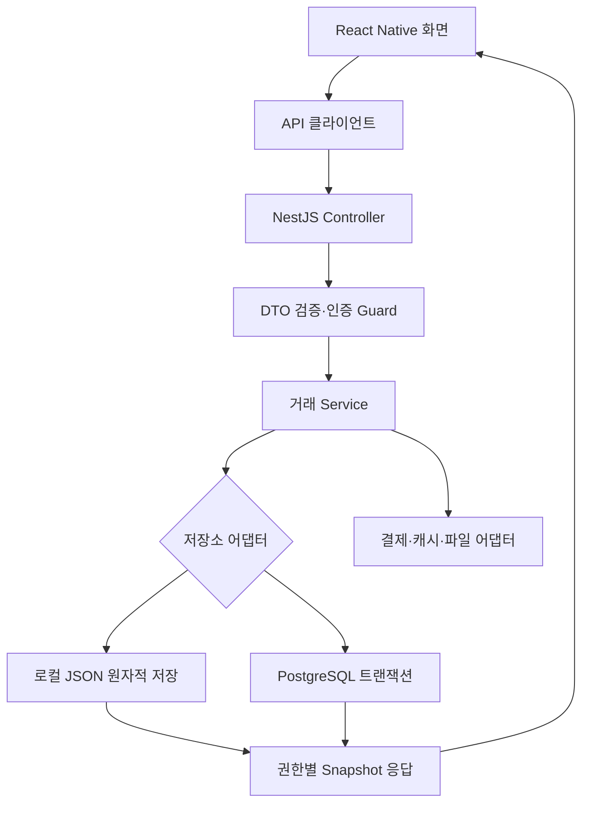
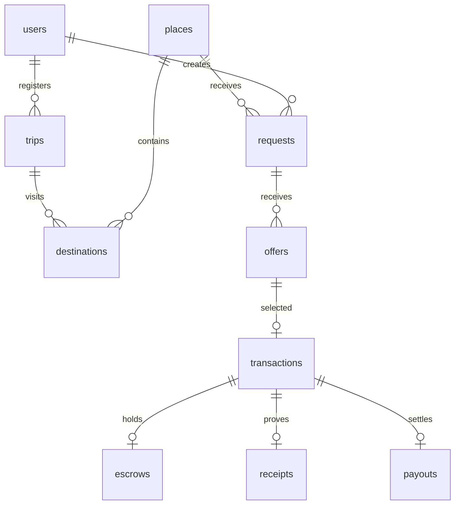

# 아키텍처와 데이터 설계

## 선택한 기술

| 영역        | 구현                                                        | 이유                                                           |
| ----------- | ----------------------------------------------------------- | -------------------------------------------------------------- |
| 모바일      | React Native 0.81 + Expo SDK 54 + TypeScript                | iOS·Android·웹 체험 화면의 컴포넌트와 타입 공유                |
| 프런트 상태 | React Context + API 클라이언트                              | 작은 MVP에서 별도 상태 라이브러리 비용을 줄임                  |
| 서버        | NestJS 11                                                   | Controller → Service → Repository 구조, DTO 입력 검증          |
| DB          | PostgreSQL 16 DDL·pg 어댑터, 로컬 파일 어댑터               | 키 없이 실행하고 SQL 저장소로 전환 가능                        |
| 캐시        | Redis/ioredis 선택 연결                                     | 메타데이터 캐시만 담당, 금액·거래의 원장으로 사용하지 않음     |
| 이미지      | 프로토타입: 크기 제한 data URL, 확장: S3 서명 업로드 어댑터 | 로컬 데모는 외부 키 불필요, 운영 시 private 객체 저장소로 이동 |
| 인증        | 24시간 무작위 bearer 토큰·가상 사용자                       | 외부 인증을 가장하지 않는 명시적 데모 로그인                   |
| 결제·지급   | PaymentProvider / PayoutProvider + Mock 구현                | 실제 금전 없이 결제·환불·보관함·출금 흐름 검증                 |
| 본인확인    | IdentityProvider + Mock 구현                                | PASS/SMS 연결 지점을 분리하고 데모 상태를 명시                 |

SDK를 최신이라고 주장하지 않는다. 호환 버전과 `package-lock.json`을 고정해 재현 가능하게 구성했다. SDK 업그레이드는 공식 호환표에 맞춰 한 세트로 진행한다.

## 계층별 전체 흐름

은행 ODS 관점에서 보면 화면이 JSP 대신 React Native이고, **Controller → Service → DAO/Repository → DB → 응답** 흐름은 같다. 화면의 결제금액을 그대로 신뢰하지 않는다. Service가 요청·제안에서 금액을 다시 계산하고 저장한다. PG는 외부 인터페이스에 해당하며 업무 트랜잭션 안에 무작정 네트워크 호출을 넣지 않는다. 현재 Mock은 메모리 동작이라 DB transaction 안에서 실행 가능하지만 실제 PG 연결 시 outbox·대사·보상 트랜잭션으로 분리해야 한다.

## 상태 전이와 실행 주체

| 이전                 | 명령                    | 다음           | 주체              |
| -------------------- | ----------------------- | -------------- | ----------------- |
| REQUESTED            | 제안 생성               | OFFER_RECEIVED | 여행자            |
| OFFER_RECEIVED       | 제안 선택               | MATCHED        | 요청자            |
| MATCHED              | PAY                     | PAYMENT_HELD   | 구매자            |
| PAYMENT_HELD         | PURCHASE + 증빙         | PURCHASED      | 여행자            |
| PURCHASED            | TRAVEL                  | TRAVELING      | 여행자            |
| TRAVELING            | SHIP + 운송장/전달 약속 | SHIPPED        | 여행자            |
| SHIPPED              | RECEIVE_AND_CONFIRM     | CONFIRMED      | 구매자            |
| SHIPPED              | RECEIVE                 | DELIVERED      | 구매자            |
| DELIVERED            | CONFIRM                 | CONFIRMED      | 구매자            |
| CONFIRMED            | SETTLE                  | SETTLED        | 여행자, Mock 전용 |
| MATCHED/PAYMENT_HELD | CANCEL                  | CANCELLED      | 구매자            |
| 결제 후~구매 확정    | DISPUTE                 | DISPUTED       | 거래 참여자       |

TRAVELING은 여행자가 구매를 마치고 자신의 원래 복귀 동선으로 이동 중인 단계다. 도착 후에는 구매자가 선택한 국내 택배 또는 직접 전달로 이어진다. 새 클라이언트는 수령과 구매 확정을 `RECEIVE_AND_CONFIRM` 한 번으로 원자적으로 처리한다. 기존 `RECEIVE`와 `CONFIRM`은 중간 상태 복구와 이전 클라이언트 호환을 위해 유지한다. 실제 PG 정산은 사용자 버튼이 아니라 검증된 작업자/PG webhook 중심으로 바꿔야 한다.

## 원장과 중복 요청

- `Idempotency-Key`: 사용자+업무+키를 묶어 저장. 같은 내용 재시도는 기존 결과를 반환하고 다른 내용이면 409.
- `revision`: 화면이 본 상태의 버전을 보낸다. 이미 변경된 상태면 409로 거절한다.
- 파일 저장: 직렬화한 변경 대기열 → 복사본 변경 → 임시 파일 → rename. 실패하면 원래 상태 유지. **단일 API 프로세스 개발용**이다.
- PostgreSQL: SQL transaction + advisory lock + 지연 FK + unique index. 요청 선택·결제·증빙·정산을 원자적으로 저장한다.
- Request당 Transaction, Transaction당 Payment/Escrow/Payout은 unique다.
- 총금액 = 상품가격+보상+수수료+운송비+세금 예치액. DB CHECK도 동일한 정합성을 검증한다.
- 구매 확정 전 지급 불가. 분쟁이면 Escrow가 FROZEN으로 바뀌고 정산은 실패한다.
- 카드·간편결제·보관함은 PaymentMethod로 분리한다. 보관함 원장은 정수 원만 사용하고 SETTLE/환불/출금은 Command 멱등키와 함께 한 트랜잭션으로 기록한다.
- 파일 모드에서 다른 프로세스가 같은 파일에 동시에 쓰면 보호되지 않는다. 다중 인스턴스는 반드시 PostgreSQL 모드를 사용한다.

## Entity 매핑

| 도메인           | 실제 테이블   | 주요 관계                                   |
| ---------------- | ------------- | ------------------------------------------- |
| User             | users         | 사용자 공개 프로필                          |
| AuthIdentity     | authIdentities | 공급자별 로그인 식별자, User와 분리         |
| UserVerification | verifications | user_id                                     |
| Trip             | trips         | traveler_id                                 |
| TripDestination  | destinations  | trip_id, place_id                           |
| Place            | places        | 국가·도시·좌표                              |
| Store            | stores        | place_id                                    |
| Product          | products      | place_id, 예시 카탈로그                     |
| ProductRequest   | requests      | requester_id, place_id, delivery_country    |
| TravelerOffer    | offers        | request_id, traveler_id, trip_id, bundle_id |
| BundleRequest    | bundles       | trip_id, place_id, requestIds/offerIds      |
| Transaction      | transactions  | request_id, offer_id, buyer_id, traveler_id |
| Payment          | payments      | transaction_id unique                       |
| PaymentMethod    | paymentMethods | 사용자별 Mock 결제수단, 전체 카드번호 없음  |
| Escrow           | escrows       | transaction_id unique                       |
| Receipt          | receipts      | transaction_id unique                       |
| Shipment         | shipments     | transaction_id unique                       |
| ChatRoom         | rooms         | transaction_id unique                       |
| Message          | messages      | room_id, sender_id                          |
| Review           | reviews       | transaction_id + author_id unique           |
| Notification     | notifications | user_id, request_id 또는 transaction_id     |
| Payout           | payouts       | transaction_id unique                       |
| Wallet/WalletTransaction | wallets/walletTransactions | 사용자별 잔액과 append 방식 체험 원장 |
| PayoutAccount/Withdrawal | payoutAccounts/withdrawals | 끝 4자리 계좌 표시와 Mock 출금 상태 |
| Dispute          | disputes      | transaction_id, opened_by                   |
| FavoritePlace    | favorites     | user_id + place_id unique                   |
| SearchHistory    | searches      | user_id, query                              |
| AuditEvent       | events        | actor_id, transaction_id, from/to           |
| Command          | commands      | 멱등성 키와 결과, 외부 응답 제외            |

### PostgreSQL 저장 형태

`database/001_initial.sql`은 각 Entity를 별도 테이블에 저장한다. 공통 `id`, `payload JSONB`에 전체 타입을 보존하고 검색·FK·금액 필드는 **타입 있는 GENERATED STORED 컬럼**으로 노출한다. JSON 덩어리 하나에 모든 앱 데이터를 저장하는 방식은 아니다. SQL에서 `SELECT product_name, delivery_city FROM moa.requests`처럼 조회할 수 있다.

프로토타입 Repository는 업무 처리 시 컬렉션을 읽고 변경된 행만 upsert한다. 작은 데모의 일관성을 위한 구현이며 대규모 서비스 최적화는 아니다. 운영 확장 시 요청별 row lock, 필요한 행만 조회하는 Repository, cursor pagination, 정산 원장 전용 append-only ledger를 도입한다. 기존 FK·unique·CHECK와 도메인 Service 테스트를 유지하며 교체할 수 있다.

## API/화면 경계

Snapshot은 공개 장소·상품 요청과 현재 거래 참여자가 접근할 수 있는 주문·증빙·대화만 합친다. 타인의 비공개 거래, 증빙, 대화, 알림, 정산, 멱등성 결과는 내려보내지 않는다. 토큰은 native SecureStore, 웹은 체험용 sessionStorage에 저장한다. 세션은 서버 재시작 시 만료된다.

여행 일정은 `TravelRouteMap`, `PlaneRouteAnimation`, `LocalRoutePath`, `TripTimeline`으로 분리한다. 국제 이동만 비행기 Motion으로 표현하고 현지 방문은 좌표 기반 Point/Route Line으로 구분한다. Reduced Motion이면 비행기를 도착 위치에 정적으로 표시하며 텍스트 일정은 항상 즉시 제공한다. 좌표는 Place에 있으나 실제 길찾기·항공편·GPS는 호출하지 않는다. 실운영에서는 국내 Naver/Kakao, 해외 지도 공급자를 adapter로 분리하고 API키 제한·이용약관·국가별 coverage를 확인한다.

## 유지보수와 디버깅

1. UI 문제는 `AppContext`의 route/role/현재 사용자와 요청 응답부터 확인한다.
2. API 400은 DTO 타입·날짜 형식·허용 카테고리, 401은 서버 재시작/세션, 403은 행위 주체, 409는 버전·예산·현재 상태를 확인한다.
3. `X-Request-Id`와 audit `transactionId`로 흐름을 묶는다. 운영에서는 구조화 로그와 민감정보 마스킹을 추가한다.
4. 금액이 다르면 quantity·통화·고정 데모 환율·운송 종류를 순서대로 확인한다. 화면의 format 함수는 계산의 원장이 아니다.
5. PostgreSQL 시작 전 migration이 필요하다. Redis 장애는 캐시 miss로 처리하지만 DB 장애를 성공으로 바꾸지는 않는다.
6. 실 PG의 timeout/중복 webhook은 로컬 원자적 파일 저장으로 해결되지 않는다. idempotent 승인 API, 서명 검증 webhook inbox, 정산 outbox, 일별 대사 작업을 별도로 구현한다.

## 출시 전 남은 업무

실 OAuth/휴대폰/계좌 인증, PG 계약·보관 주체·실 webhook, 세금과 운송 조건 검증, 민감정보 동의·보관·파기, 환불/부분 품절/가격 변경 승인, 분쟁 해결 운영화면, 이미지 악성 파일 검사·원본 비공개, 실제 검색 수집, 실시간 재고, 실제 지도, 접근성 기기 검증, 푸시 알림·실시간 채팅 서버, rate limit 외부 저장소, 비정상 거래 탐지. 이 항목은 현재 구현된 것으로 표시하지 않는다.
